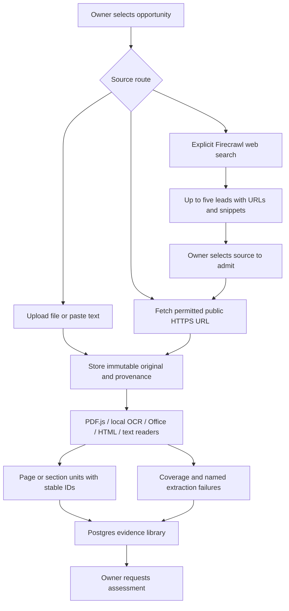
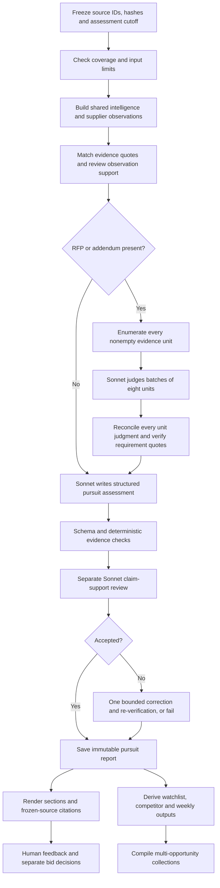
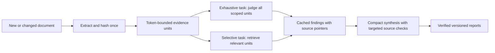

# Groundwork system flow

## Current implementation

React/Vite and TypeScript in the browser; a Node.js/TypeScript Fastify API and durable worker on Railway. PostgreSQL stores accounts, opportunities, extracted units, job state, immutable report payloads, reviews, source references and the spend ledger. A persistent private volume stores original documents, extraction artefacts and provider receipts. Official Claude Code runs under its own persistent home with subscription authentication; no Anthropic API-key fallback.

Firecrawl performs search only: no automatic scraping, site-wide crawl, admission of search snippets, or source acquisition from returned leads. Hosted activation is tracked in the build checkpoint. Searches reserve two included credits before the call; uncertain outcomes retain their reservation. GETS/RealMe automation remains blocked. Upload extraction happens when the source is saved; report generation requires a separate action.

Text PDFs use PDF.js; scanned pages use bounded local Poppler/Tesseract English OCR. DOCX paragraphs/tables and XLSX worksheets/cells use bounded ZIP/XML readers. HTML uses Cheerio to extract content blocks. Text uses numbered sections. These are software readers, not AI models. The PDF viewer opens the frozen original with mechanically located highlights. See `docs/source-management-readers.md` for exact format limits and coverage rules. Unread required evidence blocks dependent review; an explicit scope exclusion is recorded and does not count as reading it.

Only successfully validated corrections reach the saved report. A verifier cannot author or strengthen claims. Mechanical quote matching and semantic claim support are separate checks. Human acceptance remains necessary. Historical reports are not overwritten by new sources or findings.

All model stages currently select Sonnet with low effort; the last hosted receipt reported `claude-sonnet-5`. Support verification is a separate call using the same model family. Completed stages are cached by account, input and method, including prompt/schema identity. Companion compilation uses saved intelligence without another model call. The hosted application still has its deployed source and report limits. The isolated [large-pack analysis branch](large-pack-analysis.md) removes the pack-wide 160,000-character analysis guard locally and adds a bounded, durable segment ledger; it has not been deployed to Railway. Source admission limits, including 20 documents and 200 PDF pages, are separate.

## Proposed next steps, not implemented

- Source management now supports metadata versions, file replacement, archive/restore and historical citation preservation. Permanent erasure and its effects on historical evidence remain a separate retention decision.
- Readers now pass synthetic PDF/OCR, XLSX and DOCX qualification and Linux/browser checks. Validate representative customer packs before widening the documented limits; drawings, embedded objects and legacy formats remain unsupported. No model fallback is used.
- Larger packs: the isolated branch now streams saved units, batches exact-offset segments, stores a source-linked outcome ledger and synthesises from a bounded selection of verified findings. Future work is to qualify changed-document reuse across runs, targeted source retrieval and semantic recall on a complete customer pack. Add vector/hybrid retrieval only when a measured missed-evidence case justifies it; do not add another database by default.
- Effort policy to evaluate: low for straightforward extraction/classification; medium for report synthesis and support checking; high for demonstrably difficult contradictory evidence or a reviewer-requested reassessment. Do not escalate merely because evidence is missing. Include effort in stage cache identity before enabling per-stage effort changes. No effort change has been deployed.

The proposed design is deliberately incremental: retain the current Postgres-backed worker, budget controls and immutable evidence model. Validate accuracy, latency and usage on a real evaluation pack before increasing corpus limits or changing model routing.
